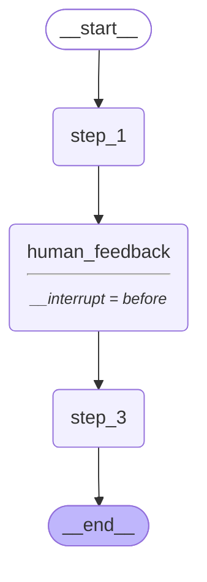

# graph-persistence
This is a very simple project that shows the setup of a memory mechanism
for a human-in-the-loop system. 



## Utilities

```sh
poetry add langgraph langchain-community python-dotenv black isort grandalf
```